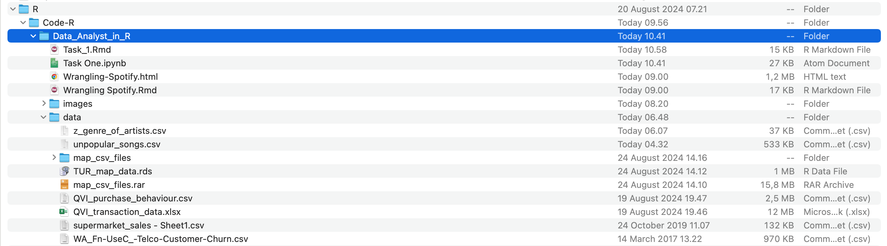

# Setting Rmarkdown
```{r setup, include=FALSE}
# set options for R markdown knitting
knitr::opts_chunk$set(echo = TRUE)
knitr::opts_chunk$set(linewidth=80)
```
```{r knitr line wrap setup, include=FALSE}
# set up line wrapping in MD knit output
library(knitr)
hook_output = knit_hooks$get("output")
knit_hooks$set(output = function(x, options)
{
 # this hook is used only when the linewidth option is not NULL
 if (!is.null(n <- options$linewidth))
 {
 x = knitr:::split_lines(x)
 # any lines wider than n should be wrapped
 if (any(nchar(x) > n))
 x = strwrap(x, width = n)
 x = paste(x, collapse = "\n")
 }
 hook_output(x, options)
})
```

## Solution template for Task 1

+ This file is a solution template for the Task 1 of the Quantium Virtual Internship.
It will walk you through the analysis, providing the scaffolding for your solution
with gaps left for you to fill in yourself.
+ Look for comments that say <code style="background:yellow;color:black">"over to you"</code> for places where you need to add your own
code!
+ Often, there will be hints about what to do or what function to use in the text
leading up to a code block - if you need a bit of extra help on how to use a
function, the internet has many excellent resources on R coding, which you can find
using your favourite search engine. 

## Load required libraries and datasets
+ Note that you will need to install these libraries if you have never used these
before and make sure it works in the right work directory.
```{r}
getwd()
```

#### Point the filePath to where you have downloaded the datasets to and assign the data files to data.tables

### over to you! fill in the path to your working directory. If you are on a Windows machine, you will need to use forward slashes (/) instead of backshashes (\)

```{r}
setwd("/Users/burhanudin/Study_burhanudin_6/R/Code-R/Data_Analyst_in_R")
```


```{r 0 Load Libraries, results = 'hide'}
#### Example code to install packages
#install.packages("data.table")

#### Load required libraries
library(data.table)
library(ggplot2)
library(ggmosaic)
library(readr)
library("readxl")
library(dplyr)

#### Point the filePath to where you have downloaded the datasets to and assign the data files to data.tables


transactionData <- read_excel("data/QVI_transaction_data.xlsx")
customerData <- fread("data/QVI_purchase_behaviour.csv")
```

## Exploratory data analysis
The first step in any analysis is to first understand the data. Let's take a look at each of the datasets provided.

### Examining transaction data
We can use `str()` to look at the format of each column and see a sample of the data. As we have read in the dataset as a `data.table` object, we can also run `transactionData` in the console to see a sample of the data or use`head(transactionData)` to look at the first 10 rows.

Let's check if columns we would expect to be numeric are in numeric form and date columns are in date format.

```{r Examining transaction data}
#### Examine transaction data
# Examine the data using one or more of the methods described above.
str(transactionData)
```

```{r}
###E see a sample of the data
head(transactionData,10)
```


We can see that the <font color=red>DATE</font> column is in an **integer** format. Let's change this to a date format.

```{r Convert DATE to date format}
#### Convert DATE column to a date format A quick search online tells us that CSV and Excel integer dates begin on 30 Dec 1899
transactionData$DATE <- as.Date(transactionData$DATE, origin = "1899-12-30")
```

We should check that we are looking at the right products by examining PROD_NAME.

```{r Summary of PROD_NAME}
#### Examine PROD_NAME
# Generate a summary of the PROD_NAME column.
summary(transactionData, PROD_NAME)
```

Looks like we are definitely looking at potato chips but how can we check that these are all chips? We can do some basic text analysis by summarising the individual words in the product name.

```{r Further examine PROD_NAME}
#### Examine the words in PROD_NAME to see if there are any incorrect entries such as products that are not chips
productWords <- data.table(unlist(strsplit(unique(transactionData$PROD_NAME), "")))
setnames(productWords, 'words')
```

As we are only interested in words that will tell us if the product is chips or not, let's remove all words with digits and special characters such as '&' from our set of product words. We can do this using `grepl()`.

```{r}
# Over to you! Remove digits, and special characters, and then sort the distinct words by frequency of occurrence.
library(stringi)
library(stringr)
#### Removing digits
productWords$words <- str_remove(productWords$words, "[[:digit:]]")
#### Removing special characters
productWords$words <- str_remove(productWords$words, "[[:punct:]]")
#### Let's look at the most common words by counting the number of times a word appears and
splitWords <- strsplit(productWords$words, " ")
splitWords.freq <- table(unlist(splitWords))
#### sorting them by this frequency in order of highest to lowest frequency
splitWords.freq <- as.data.frame(splitWords.freq)
splitWords.freq <- splitWords.freq[order(splitWords.freq$Freq, decreasing = T),]
```

There are salsa products in the dataset but we are only interested in the chips category, so let's remove these.

```{r}
#### Remove salsa products
transactionData<- data.table(transactionData)
transactionData[, SALSA := grepl("salsa", tolower(PROD_NAME))]
transactionData <- transactionData[SALSA == FALSE, ][, SALSA := NULL]
```

Next, we can use `summary()` to check summary statistics such as mean, min and max values for each feature to see if there are any obvious outliers in the data and if there are any nulls in any of the columns (`NA's : number of nulls` will appear in the output if there are any nulls).

```{r initial summary}
#### Summarise the data to check for nulls and possible outliers

# Over to you!
summary(transactionData)
```

There are no nulls in the columns but product quantity appears to have an outlier which we should investigate further. Let's investigate further the case where 200 packets of chips are bought in one transaction.

```{r }
#### Filter the dataset to find the outlier
# Over to you! Use a filter to examine the transactions in question.
prodQyt_200 <- transactionData[PROD_QTY == 200,]
print(prodQyt_200)
```

There are two transactions where 200 packets of chips are bought in one transaction and both of these transactions were by the same customer.

```{r}
#### Let's see if the customer has had other transactions

# Over to you! Use a filter to see what other transactions that customer made.
sameCustomer <- transactionData[LYLTY_CARD_NBR == 226000,]
print(sameCustomer)
```

It looks like this customer has only had the two transactions over the year and is not an ordinary retail customer. The customer might be buying chips for commercial purposes instead. We'll remove this loyalty card number from further analysis.

```{r}
#### Filter out the customer based on the loyalty card number
# Over to you!
transactionData <- transactionData[LYLTY_CARD_NBR != 226000] 
#### Re-examine transaction data
# Over to you!
summary(transactionData)
```

That's better. Now, let's look at the number of transaction lines over time to see if there are any obvious data issues such as missing data.

```{r}
#### Count the number of transactions by date
# Over to you! Create a summary of transaction count by date.
transactionDataCount <- count(transactionData, transactionData$DATE)
nrow(transactionDataCount)
```

There's only 364 rows, meaning only 364 dates which indicates a missing date. Let's create a sequence of dates from 1 Jul 2018 to 30 Jun 2019 and use this to create a chart of number of transactions over time to find the missing date.

```{r fig.align = "center"}
#### Create a sequence of dates and join this the count of transactions by date
# Over to you - create a column of dates that includes every day from 1 Jul 2018 to 30 Jun 2019, and join it onto the data to fill in the missing day.
transactions_by_day <- transactionDataCount %>%
  filter(
    transactionDataCount$`transactionData$DATE` >= "2018-07-01" &
      transactionDataCount$`transactionData$DATE` <= "2019-06-30"
  )

#### Setting plot themes to format graphs
theme_set(theme_bw())
theme_update(plot.title = element_text(hjust = 0.5))

#### Plot transactions over time
N <- transactions_by_day$n
DATE <- transactions_by_day$`transactionData$DATE`
ggplot(transactions_by_day, aes(x = DATE, y = N)) + geom_line() + labs(x = "Day", y = "Number of transactions", title = "Transactions over time") + scale_x_date(breaks = "1 month") + theme(axis.text.x = element_text(angle = 90, vjust = 0.5))
```

We can see that there is an increase in purchases in December and a break in late December. Let's zoom in on this.

```{r fig.align = "center"}
#### Filter to December and look at individual days
# Over to you - recreate the chart above zoomed in to the relevant dates.
dec_date <- transactions_by_day %>%
  filter(
    transactions_by_day$`transactionData$DATE` >= "2018-12-01" &
      transactions_by_day$`transactionData$DATE` <= "2018-12-31"
  )
N_DEC <- dec_date$n  
DATE_DEC <-dec_date$`transactionData$DATE`
ggplot(dec_date, aes(x = DATE_DEC, y = N_DEC))+
  geom_line()+
  labs(x = "Day", y = "Number of transactions", title = "Transactions over December")+
  scale_x_date(breaks = "1 day") +
  theme(axis.text.x = element_text(angle = 90, vjust = 0.5))
```

We can see that the increase in sales occurs in the lead-up to Christmas and that there are zero sales on Christmas day itself. This is due to shops being closed on Christmas day.

Now that we are satisfied that the data no longer has outliers, we can move on to creating other features such as brand of chips or pack size from PROD_NAME. We will start with pack size.

```{r Create pack size}
#### Pack size We can work this out by taking the digits that are in PROD_NAME

transactionData[, PACK_SIZE := parse_number(PROD_NAME)]
#### Always check your output Let's check if the pack sizes look sensible transactionData[, .N, PACK_SIZE][order(PACK_SIZE)]
```

The largest size is 380g and the smallest size is 70g - seems sensible!

```{r }
#### Let's plot a histogram of PACK_SIZE since we know that it is a categorical variable and not a continuous variable even though it is numeric.
# Over to you! Plot a histogram showing the number of transactions by pack size.
hist(transactionData[, PACK_SIZE])
```

Pack sizes created look reasonable.
Now to create brands, we can use the first word in PROD_NAME to work out the brand
name...

```{r Create brand name}
#### Brands
# Over to you! Create a column which contains the brand of the product, by extracting it from the product name.
transactionData$BRAND_NAME <- gsub("([A-Za-z]+).*", "\\1", transactionData$PROD_NAME)
#### Checking brands
# Over to you! Check the results look reasonable.
brands <- data.table(unlist(unique(transactionData$BRAND_NAME)))
print(brands)
```

Some of the brand names look like they are of the same brands - such as RED and RRD, which are both Red Rock Deli chips. Let's combine these together.

```{r Clean brand names}

#### Clean brand names transactionData[BRAND == "RED", BRAND := "RRD"]
# Over to you! Add any additional brand adjustments you think may be required.
transactionData[BRAND_NAME == "RED", `:=`(BRAND_NAME, "RRD")]
transactionData[BRAND_NAME == "GRAIN", `:=`(BRAND_NAME, "GrnWves")]
transactionData[BRAND_NAME == "INFZNS", `:=`(BRAND_NAME, "Infuzions")]
transactionData[BRAND_NAME == "WW", `:=`(BRAND_NAME, "Woolworths")]
transactionData[BRAND_NAME == "SNBTS", `:=`(BRAND_NAME, "Sunbites")]
#### Check again
# Over to you! Check the results look reasonable.
brands <- data.frame(sort(table(transactionData$BRAND_NAME), decreasing = T))
setnames(brands, c("Brand", "freq"))
ggplot(brands, aes(x = Brand, y = freq))+
  geom_bar(stat = "identity", width = 0.7)+
  labs(x = "Brand Name", y = "Frequency", title = "Distribution Of Brand Purchases")+
  theme(axis.text.x = element_text(angle = 90, vjust = 0.5)) 
```

### Examining customer data
Now that we are happy with the transaction dataset, let's have a look at the
customer dataset.

```{r 1 Exploratory data analysis}
#### Examining customer data
# Over to you! Do some basic summaries of the dataset, including distributions of any key columns.
str(customerData)
```
Let’s have a closer look at the LIFESTAGE and PREMIUM_CUSTOMER columns.
```{r}
### Examining the values of lifestage and premium_customer
lifestageCat <- data.frame(sort(table(customerData$LIFESTAGE),decreasing = TRUE ))
setnames(lifestageCat,c("lifestage","N"))
lifestageCat

### PERMIUM_CUSTOMER
permiumCust <- data.frame(sort(table(customerData$PREMIUM_CUSTOMER),decreasing = TRUE ))
setnames(permiumCust,c("lifestage","N"))
permiumCust
```
```{r }
#### Merge transaction data to customer data
data <- merge(transactionData, customerData, all.x = TRUE)
```

As the number of rows in `data` is the same as that of `transactionData`, we can bevsure that no duplicates were created. This is because we created `data` by setting `all.x = TRUE` (in other words, a left join) which means take all the rows in `transactionData` and find rows with matching values in shared columns and then joining the details in these rows to the `x` or the first mentioned table.

Let's also check if some customers were not matched on by checking for nulls.

```{r Check for missing customer details}
# Over to you! See if any transactions did not have a matched customer.
sum(is.na(data))
```

Great, there are no nulls! So all our customers in the transaction data has been accounted for in the customer dataset.
Note that if you are continuing with Task 2, you may want to retain this dataset which you can write out as a csv

```{r Code to save dataset as a csv}
write.csv(data, file=file.path('output/','QVI_data.csv'))

```

Data exploration is now complete!

## Data analysis on customer segments
Now that the data is ready for analysis, we can define some metrics of interest to
the client:
- Who spends the most on chips (total sales), describing customers by lifestage and how premium their general purchasing behaviour is
- How many customers are in each segment
- How many chips are bought per customer by segment
- What's the average chip price by customer segment

We could also ask our data team for more information. Examples are:
- The customer's total spend over the period and total spend for each transaction to understand what proportion of their grocery spend is on chips
- Proportion of customers in each customer segment overall to compare against the mix of customers who purchase chips
Let's start with calculating total sales by LIFESTAGE and PREMIUM_CUSTOMER and plotting the split by these segments to describe which customer segment contribute most to chip sales.

```{r fig.width = 10, fig.align = "center"}
#### Total sales by LIFESTAGE and PREMIUM_CUSTOMER
# Over to you! Calculate the summary of sales by those dimensions and create a plot.
sales <- data[, .(SALES = sum(TOT_SALES)), .(LIFESTAGE, PREMIUM_CUSTOMER)]

p <- ggplot(sales)+
  geom_mosaic(aes(weight = SALES, x = product(PREMIUM_CUSTOMER, LIFESTAGE), fill = PREMIUM_CUSTOMER))+
  labs( x= "LIFESTAGE & PREMIUM CUTOMER", y = "Total Sales purchased", title = "Total Sales over LIFE STAGE & PREMIUM CUSTOMERS")+
  theme(axis.text.x = element_text(angle = 90, vjust = 0.5))+
  scale_fill_brewer(palette = "Dark2")

p + geom_text(data = ggplot_build(p)$data[[1]], aes(x = (xmin + xmax)/2 , y =
(ymin + ymax)/2, label = as.character(paste(round(.wt/sum(.wt),3)*100,
'%'))))
```

Sales are coming mainly from Budget - older families, Mainstream - young singles/couples, and Mainstream - retirees
Let's see if the higher sales are due to there being more customers who buy chips.

```{r fig.width = 10, fig.align = "center"}
#### Number of customers by LIFESTAGE and PREMIUM_CUSTOMER
# Over to you! Calculate the summary of number of customers by those dimensions and create a plot.
customers <- data[, .(CUSTOMERS = uniqueN(LYLTY_CARD_NBR)), .(LIFESTAGE, PREMIUM_CUSTOMER)][order(-CUSTOMERS)]

p <- ggplot(customers)+
  geom_mosaic(aes(weight = CUSTOMERS, x = product(PREMIUM_CUSTOMER, LIFESTAGE), fill = PREMIUM_CUSTOMER))+
  labs( x= "Lifestage", y = "Premium customer flag", title = "Proportion of customers")+
  theme(axis.text.x = element_text(angle = 90, vjust = 0.5))+
  scale_fill_brewer(palette = "Dark2")

p + geom_text(data = ggplot_build(p)$data[[1]], aes(x = (xmin + xmax)/2 , y =
(ymin + ymax)/2, label = as.character(paste(round(.wt/sum(.wt),3)*100,
'%'))))
```

There are more Mainstream - young singles/couples and Mainstream - retirees who buy chips. This contributes to there being more sales to these customer segments but this is not a major driver for the Budget - Older families segment.
Higher sales may also be driven by more units of chips being bought per customer.
Let's have a look at this next.

```{r fig.width = 10, fig.align = "center"}
#### Average number of units per customer by LIFESTAGE and PREMIUM_CUSTOMER
# Over to you! Calculate and plot the average number of units per customer by those two dimensions.
avgNUnit <- data[, .(AVG = sum(PROD_QTY)/uniqueN(LYLTY_CARD_NBR)), .(LIFESTAGE, PREMIUM_CUSTOMER)][order(-AVG)]

ggplot(avgNUnit, aes(weight = AVG, x = LIFESTAGE, fill = PREMIUM_CUSTOMER))+
  geom_bar(position = position_dodge())+
  labs( x= "Lifestage", y = "Avg units per transaction", title = "Units per customer")+
  theme(axis.text.x = element_text(angle = 90, vjust = 0.5))+
  scale_fill_brewer(palette = "Dark2")
```

Older families and young families in general buy more chips per customer
Let's also investigate the average price per unit chips bought for each customer segment as this is also a driver of total sales.

```{r fig.width = 10, fig.align = "center"}
#### Average price per unit by LIFESTAGE and PREMIUM_CUSTOMER
# Over to you! Calculate and plot the average price per unit sold (average sale price) by those two customer dimensions.
pricePerUnit <- data[, .(PRICE = sum(TOT_SALES)/sum(PROD_QTY)), .(LIFESTAGE, PREMIUM_CUSTOMER)][order(-PRICE)]

ggplot(pricePerUnit, aes(weight = PRICE, x = LIFESTAGE, fill = PREMIUM_CUSTOMER))+
  geom_bar(position = position_dodge())+
  labs( x= "Lifestage", y = "Avg price per unit", title = "Price per unit")+
  theme(axis.text.x = element_text(angle = 90, vjust = 0.5))+
  scale_fill_brewer(palette = "Dark2")
```

Mainstream midage and young singles and couples are more willing to pay more per packet of chips compared to their budget and premium counterparts. This may be due to premium shoppers being more likely to buy healthy snacks and when they buy chips, this is mainly for entertainment purposes rather than their own consumption.
This is also supported by there being fewer premium midage and young singles and couples buying chips compared to their mainstream counterparts.
As the difference in average price per unit isn't large, we can check if this  difference is statistically different.

```{r}
#### Perform an independent t-test between mainstream vs premium and budget midage and young singles and couples
# Over to you! Perform a t-test to see if the difference is significant.
PriceUnit <- data$TOT_SALES / data$PROD_QTY
t.test(
  c(
    data$LIFESTAGE %in% c("YOUNG SINGLES/COUPLES","MIDAGE SINGLES/COUPLES") & data$PREMIUM_CUSTOMER == "Mainstream", PriceUnit
  ),
    c(
    data$LIFESTAGE %in% c("YOUNG SINGLES/COUPLES","MIDAGE SINGLES/COUPLES") & data$PREMIUM_CUSTOMER != "Mainstream", PriceUnit
  )
)
```

The t-test results in a p-value of XXXXXXX, i.e. the unit price for mainstream, young and mid-age singles and couples [ARE / ARE NOT] significantly higher than that of budget or premium, young and midage singles and couples.

## Deep dive into specific customer segments for insights
We have found quite a few interesting insights that we can dive deeper into.
We might want to target customer segments that contribute the most to sales to retain them or further increase sales. Let's look at Mainstream - young singles/couples. For instance, let's find out if they tend to buy a particular brand of chips.

```{r fig.align = "center"}
#### Deep dive into Mainstream, young singles/couples
# Over to you! Work out of there are brands that these two customer segments prefer more than others. You could use a technique called affinity analysis or a-priori analysis (or any other method if you prefer)
segmentOne <- data[
  LIFESTAGE == "YOUNG SINGLES/COUPLES" & PREMIUM_CUSTOMER == "Mainstream",
]
otherSegment <- data[
  LIFESTAGE != "YOUNG SINGLES/COUPLES" & PREMIUM_CUSTOMER != "Mainstream"
]
qSegmentOne <- sum(segmentOne$PROD_QTY)
qOtherSement <- sum(otherSegment$PROD_QTY)

qSegmentOneByBrand <- segmentOne[, .(tragetSegment = sum(PROD_QTY)/ qSegmentOne), by = BRAND_NAME]
qOtherSementByBrand <- otherSegment[, .(noTragetSement = sum(PROD_QTY)/ qOtherSement), by = BRAND_NAME]

brandPortion <- merge(qSegmentOneByBrand, qOtherSementByBrand)[, affinityByBrand :=tragetSegment /noTragetSement]

brandPortion[order(-affinityByBrand)]

ggplot(brandPortion, aes(x = BRAND_NAME, y = affinityByBrand))+
  geom_bar(stat = "identity", width = 0.5)+
  labs(x = "Brand", y = "Customers Affinity to Brand", title = "Favorite brands of Customers") + 
  theme(axis.text.x = element_text(angle = 90, vjust = 0.5))
```

We can see that :
<code style="background:yellow;color:black">INSIGHTS</code>

+ Let's also find out if our target segment tends to buy larger packs of chips.

```{r fig.align = "center"}
#### Preferred pack size compared to the rest of the population
# Over to you! Do the same for pack size.
qSegmentOneByPack <- segmentOne[, .(tragetSegment = sum(PROD_QTY)/ qSegmentOne), by = PACK_SIZE]
qOtherSementByPack <- otherSegment[, .(noTragetSement = sum(PROD_QTY)/ qOtherSement), by = PACK_SIZE]

brandPortionPack <- merge(qSegmentOneByPack, qOtherSementByPack)[, affinityByPack :=tragetSegment /noTragetSement]

brandPortionPack[order(-affinityByPack)]
```

<code style="background:yellow;color:black">INSIGHTS</code>

+ It looks like Mainstream young singles/couples are 27% more likely to purchase a 270g pack of chips compared
to the rest of the population but let’s dive into what brands sell this pack size.
```{r}
data[PACK_SIZE == 270, unique(PROD_NAME)]
```

##  Conclusion

Let’s recap what we’ve found! 

+ Sales have principally been because of Budget - older families,thought young singles/couples, and thought - retirees shoppers. 
+ we have a tendency to found that the high pay on chips for mainstream young singles/couples and retirees is due to there being a lot of of them than alternative buyers. thought, mid-age, and young singles and couples are more seemingly to pay more per packet of chips. this is often indicative of impulse shopping for behavior.
+ We’ve also found that Mainstream young singles and couples are 23% more likely to get Tyrrells chips compared to the remainder of the population. 
+ The class Manager might want to extend the category’sperformance by off-locating some Tyrrells and smaller packs of chips in discretionary area close to segments wherever young singles and couples frequent a lot of typically to increase visibility and impulse behavior.
+ Quantium will facilitate the class Manager with recommendations of where these segments are and morehelp them with measure the impact of the modified placement.