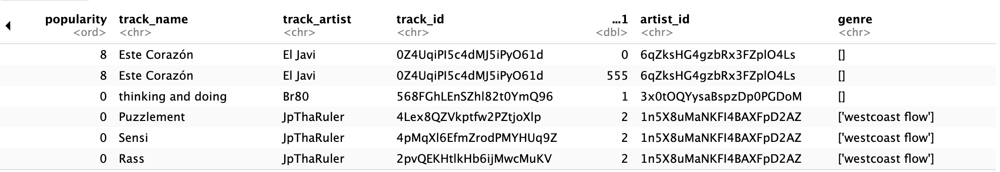

```{r setup, include=FALSE}
knitr::opts_chunk$set(echo = TRUE)
```

## R Markdown

This is an R Markdown document. Markdown is a simple formatting syntax for authoring HTML, PDF, and MS Word documents. For more details on using R Markdown see <http://rmarkdown.rstudio.com>.

When you click the **Knit** button a document will be generated that includes both content as well as the output of any embedded R code chunks within the document. You can embed an R code chunk like this:


# Step 1: Import packages

```{r}
#install.packages("outliers")
#install.packages("MVN")
#install.packages("here")
library(readr) 
library(dplyr)
library(magrittr)
library(outliers)
library(MVN)
library(here)
library(tidyr)
library(ggplot2)
library(kableExtra)
library(stringr)
library(splitstackshape)
library(lubridate)
library(editrules)
library(forecast)
```
# Step 2: Import Data

Paket readr digunakan untuk mengimpor dan membaca data dari file csv yang berisi kumpulan data. Untuk unpopular_songs.csv dan z_genre_of_artists.csv, kami memuat data ke dalam bingkai data unpopular_songs dan genre.

Please confirmed that you in work directory:
```{r}
getwd()
```


```{r}
setwd("/Users/burhanudin/Study_burhanudin_6/R/Code-R/Data_Analyst_in_R")
```


```{r}
#Import the two csv files and save them in separate data frames
unpopular_songs <- read_csv("data/unpopular_songs.csv")
genre <- read_csv("data/z_genre_of_artists.csv")
```

# Step 3: Data Sets Overview

+ Kita mulai dengan memeriksa 6 baris awal dari kedua kumpulan data. Dengan menggunakan fungsi head(), kita memeriksa 6 baris pertama dari setiap kumpulan data.

```{r}
#Show the first six rows of "unpopular_songs" dataframe
head(unpopular_songs)

#Show the first six rows of "genre" data frame
head(genre)

#Check the number of observations in "unpopular_songs"
unpopular_songs %>% count()

#Check the number of observations in "genre"
genre %>% count()
```

+ Hasil `count()` mengungkapkan bahwa variabel “lagu tidak populer” dan “genre” masing-masing memiliki 4073	 dan 701	 observasi.

# Step 4: Remove Duplicates

+ Untuk mengidentifikasi dan menghapus semua observasi yang terduplikasi, kami menggunakan fungsi `unique()` atau `distinct()` untuk memeriksa jumlah observasi yang berbeda. Setelah menghilangkan observasi yang terduplikasi, jumlah observasi yang unik dihitung dengan fungsi `count()`

```{r}
#Check the distinct number of observations in "unpopular_songs"
unpopular_songs %>% unique() %>% count()

#Check the distinct number of observations in "genre"
genre %>% distinct() %>% count()
```

+ Hasil count() mengungkapkan bahwa variabel “lagu tidak populer” dan “genre” masing-masing memiliki 4073 dan 701 observasi berbeda.

+ Karena memilihi hasil angka syang sama dari hasil pengamatan `distinc()` dan `count()` sehingga daopat di simpulkan  `tidak ada duplikasi data`


# Step 5: Merge Data Sets

Fungsi left_join dari paket dplyr digunakan untuk menggabungkan dua set data (unpopular_songs dan genre) berdasarkan variabel umum “track_artist” pada set data pertama dan “artist_name” pada set data kedua. Left join memastikan bahwa semua baris dari set data unpopular_songs dipertahankan, dan baris yang cocok dari set data new_genre ditambahkan, sehingga menghasilkan set data gabungan tempat informasi dari kedua set data digabungkan berdasarkan variabel yang ditentukan. Kerangka data baru bernama “songs” dibuat.

```{r}
songs <- unpopular_songs %>% left_join(genre, by=c("track_artist"="artist_name"))
```
```{r}
# Head data songs
head(songs)
```

# Step 6: Check Data Structure
+ Selanjutnya, kita akan memeriksa struktur data dan tipe variabel. Pertama, kita periksa dimensi kerangka data menggunakan fungsi dim().

```{r}
#Checking dimenions of songs
dim(songs)
```

+  Kemudian kami memeriksa tipe variabel pada kumpulan data gabungan “lagu” menggunakan fungsi `str()`.

```{r}
# Checking the structure of the data
str(songs)
```

+ Sebagian besar variabel bersifat numerik (misalnya valensi, tempo, durasi ms). Variabel-variabel tersebut mewakili elemen musik dari lagu tersebut. Ada beberapa unit untuk beberapa variabel, termasuk dB, BPM, dan milidetik. "Eksplisit" adalah variabel unik yang memiliki struktur berbasis logika karena variabel tersebut diambil dari data asli sebagai BENAR atau SALAH. Parameter yang tersisa (nama trek, artis trek, id trek, id artis, dan genre) mengambil tipe data karakter.

+ Selanjutnya, kita akan menerapkan konversi tipe data. Popularitas dalam kumpulan data ini menandakan peringkat lagu, dengan 0 menunjukkan peringkat terendah dan 18 menunjukkan peringkat tertinggi. Oleh karena itu, kita mengubah tipe data "popularitas" dari numerik menjadi faktor terurut menggunakan fungsi factor().

```{r}
# Converting the data type to factor
songs$popularity <- factor(songs$popularity,
                           levels=c("0", "1", "2", "3", "4", "5", "6", "7", 
                                       "8", "9", "10", "11", "12", "13", "14", 
                                       "15", "16", "17", "18"), 
                           ordered = TRUE)
```

+ Kemudian kami memverifikasi apakah transformasi berhasil atau tidak menggunakan fungsi `class()`. Transformasi yang berhasil ditunjukkan oleh fungsi yang mengembalikan “ordered” dan “factor” sebagai tipe data.

```{r}
class(songs$popularity)
```

+ Selanjutnya, kita ubah “modus” dari variabel numerik menjadi faktor. Pengamatan pada kolom modus direpresentasikan dengan angka 0 dan 1. Kita beri label 0 sebagai “mayor” dan 1 sebagai “minor” untuk menghindari kebingungan dan agar lebih mudah dipahami.

```{r}
songs$mode <- factor(songs$mode, 
                     levels = c("0","1"),
                     labels = c("Major","Minor"))
```

```{r}
# Periksa data
head(songs)
```
# Step 7.1: Tidy & Manipulate I

+ Menurut Wickham dan Grolemund (2016), ada tiga aturan yang saling terkait yang membuat kumpulan data rapi.

<div class="alert alert-block alert-info">
    
1. Setiap variabel harus memiliki kolomnya sendiri.
2. Setiap observasi harus memiliki barisnya sendiri.
3. Setiap nilai harus memiliki selnya sendiri.
   
</div>

+ Untuk kumpulan data "lagu", ia mematuhi aturan pertama dan kedua karena setiap variabel membentuk kolomnya sendiri dan setiap trek membentuk barisnya sendiri. Namun, urutan kolom tidak terlalu lengkap karena kolom nama trek diposisikan setelah sebagian besar variabel, seperti `duration_ms`, `popularity`, dll. Ini akan dirapikan pada tahap selanjutnya.

+ Meskipun demikian, ia tidak mematuhi aturan ketiga karena setiap nilai tidak memiliki selnya sendiri saat kita memeriksa nilai di bawah kolom `genre`.


+ Untuk memastikan bentuk konsisten yang sesuai dengan semantik kumpulan data dengan cara penyimpanannya, kita perlu membentuk ulang dan merapikan data menggunakan berbagai fungsi.

## Merapikan(Tidying) kolom “genre”

+ Pengamatan harus dibersihkan dengan menghapus simbol atau tanda kurung tambahan, dan urutan nilai harus disusun ulang untuk memastikan bahwa setiap sel hanya memiliki satu nilai. Pertama, kita menggunakan fungsi `str_sub` untuk menghilangkan “[ ]” yang tidak diinginkan dari setiap nilai di kolom genre.

```{r}
songs$genre <- str_sub(songs$genre, start=2L, end=nchar(songs$genre)-1L)
```

```{r}
head(songs)
```
+ Setelah itu, setiap nilai dibagi ke dalam selnya sendiri dan diubah ke format panjang menggunakan fungsi `cSpilt`. Nilai diubah ke format panjang karena kita mengikuti Prinsip Data Rapi 2 yang menyatakan bahwa setiap pengamatan harus memiliki barisnya sendiri.

```{r}
songs_2 <- cSplit(songs, "genre", sep=",", direction="long")
```

```{r}
head(songs_2)
```

+ Untuk menghilangkan ' ' yang tidak diinginkan dari nilai, fungsi `str_sub` diterapkan.

```{r}
songs_2$genre <- str_sub(songs_2$genre, start=2L, end=nchar(songs_2$genre)-1L)
```

```{r}
head(songs_2)
```

+ Karena kita bekerja dengan kerangka data yang besar, kita hanya ingin menilai variabel tertentu. Fungsi `select()` memungkinkan kita untuk memilih variabel. Karena fungsi `dplyr` tidak akan mengubah input, kita menggunakan operator penugasan untuk menyimpan hasil sebagai kumpulan data baru yang disebut `songs_selected`. Kita kemudian menerapkan fungsi `arrange()` untuk mengurutkan kumpulan data berdasarkan popularitas dan nama lagu dalam urutan menaik. Terakhir, kita menyaring lagu-lagu dengan popularitas sama dengan 0 dan mengompilasinya ke dalam kerangka data baru yang disebut `unpopular_genre` untuk mengidentifikasi lagu-lagu yang paling tidak populer dalam genre masing-masing. Beberapa lagu tidak dikategorikan, yang berisi nilai NA. Kita menggunakan `drop_na()` untuk membuang nilai null apa pun.

```{r}
#Select columns by name using the pipe operator and save it in a new data set
songs_selected <- songs_2 %>% select(popularity, track_name, track_artist, mode, duration_ms, genre)

#Order the data set according to two variables
songs_selected %<>% arrange(popularity, track_name) 

# Select songs with 0 popularity, then group them by genre
unpopular_genre <- songs_selected %>% filter(popularity == "0") %>% group_by(genre) %>% 
  summarise(number_of_most_unpopular_songs = n())

# Arrange them by descending order
unpopular_genre %>% arrange(desc(number_of_most_unpopular_songs)) %>% drop_na()
```

```{r}
head(songs_selected,10)
```

# Step 7.2: Tidy & Manipulate II
+ Setelah merapikan data, kami ingin mengubah variabel baru dari variabel duration_ms yang ada untuk memudahkan pemahaman data waktu. Saat ini durasinya dalam milidetik, tetapi kami ingin mengubah satuannya menjadi detik dan menit. Di sini kami akan menggunakan fungsi seconds_to_period() dari paket lubridate untuk menangani data waktu.

+ Karena kumpulan data asli menyediakan data waktu dalam milidetik, pertama-tama kita akan membagi duration_ms dengan 1000 sebelum menerapkan fungsi `seconds_to_period()`.

```{r}
#Use seconds_to_period function to transform duration_ms
songlength <- seconds_to_period(songs_selected$duration_ms/1000)

#Checking if the transformation is successful
head(songlength)
```

```{r}
#Check the class of songlength
class(songlength)
```

+ Kami menambahkan satu variabel baru menggunakan fungsi mutate() dari paket dplyr. Kemudian kami memeriksa apakah variabel baru telah berhasil ditambahkan ke kerangka data.

```{r}
#Create new variables "duration_min"

#Then drop the existing variable "duration_ms"
songs_selected %<>% 
  mutate(songs_selected, duration_min = round(songlength)) %>%
  select (-duration_ms)

#Checking the class of songlength
glimpse(songs_selected)
```
# Step 7.3: Tidy & Manipulate III
## Scanning Nilai yang Hilang
+ Saat kita membaca data dari dua file csv, setiap nilai yang hilang akan direpresentasikan sebagai NA untuk integer, untuk variabel karakter. Untuk mengidentifikasi nilai yang hilang dalam kerangka data, kita dapat menggunakan fungsi is.na() yang digabungkan dengan fungsi colSums() untuk menemukan total nilai yang hilang di setiap kolom dalam kerangka data kita.

```{r}
# Identitfiy total number NAs in each column
colSums(is.na(songs_selected))
```

+ Kami menemukan bahwa kolom "genre" memiliki 515 nilai NA. Karena bukan numerik, kami tidak dapat mengode ulang nilai yang hilang menggunakan operasi subset dan penugasan normal. Cara terbaik adalah menggunakan fungsi replace_na() dari paket tidyr untuk mengganti nilai NA. Karena NA berarti lagu tersebut tidak dikategorikan, kami dapat mengganti NA dengan karakter "tidak dikategorikan" untuk pemahaman yang lebih baik.

```{r}
# Replace NA values in "genre"
songs_selected$genre <- replace_na(songs_selected$genre, "uncategorized")

# Check total number of NAs in each column again to confirm there is no missing value in the data frame
colSums(is.na(songs_selected))
```


## Scanning Nilai Khusus
+ Setelah menangani nilai yang hilang, kita akan memeriksa apakah ada nilai khusus, yaitu -Inf, Inf, dan NaN. Kita dapat menggunakan fungsi is.finite, is.infinite, atau is.nan untuk mengidentifikasi nilai khusus dalam satu set data. Karena kita memeriksa seluruh kerangka data, kita perlu menggunakan fungsi keluarga apply. Kita menggunakan fungsi sapply di sini. Fungsi ini dapat diterapkan ke suatu daftar. Karena kerangka data memiliki karakteristik baik daftar maupun matriks, sapply dapat diterapkan ke kerangka data.

+ Kita buat fungsi baru untuk memeriksa jumlah nilai tak terhingga atau NaN atau NA untuk kolom numerik, dan jumlah nilai NA untuk kolom lainnya. Kita tulis fungsi di dalam sapply() dan hitung total nilai yang hilang untuk setiap kolom.

```{r}
# Check every numerical column whether they have infinite or NaN or NA values using a function
sapply(songs_selected, function(x) {
  if(is.numeric(x)) {sum(is.infinite(x) | is.nan(x) | is.na(x))} 
  else {sum(is.na(x))}
    })
```

## Memindai Kesalahan yang Jelas
+ Selanjutnya, kita akan memeriksa apakah ada ketidakkonsistenan yang jelas yang mungkin tidak sesuai dengan situasi di dunia nyata. Misalnya, durasi lagu tidak boleh negatif. Kita akan menentukan batasan pada variabel duration_min menggunakan fungsi editset dari paket editrules. Fungsi editset mengurai aturan tekstual dan menyimpannya dalam objek editset. Kumpulan data dapat diperiksa terhadap aturan ini menggunakan fungsi violationEdits. Jika ada data yang melanggar aturan, fungsi tersebut akan mengembalikan larik logis "TRUE". Di sini kita akan memeriksa jumlah totalnya.

```{r}
(Rule1 <- editset("duration_min > 0"))
violatedEdits(Rule1, songs_selected) %>% sum()
```

+ Hasil “0” berarti tidak ada data yang melanggar aturan, sehingga mengembalikan semua “FALSE” dan karenanya tidak ada “TRUE” yang dikembalikan.

# Memindai Outlier
+ Menurut metode deteksi outlier Tukey, outlier adalah nilai-nilai dalam kumpulan data yang berada di luar pagar outlier, yang merupakan sepasang batasan yang dihitung di antara rentang −1,5×IQR hingga 1,5×IQR dari boxplot.

+ Mengingat hal itu, kita mulai dengan menggunakan fungsi boxplot() untuk mendapatkan boxplot dari variabel duration_min, yang sebelumnya telah diterapkan dengan fungsi period_to_seconds() untuk mengonversi variabel tersebut ke dalam detik.

```{r}
songs_selected$duration_min %>% period_to_seconds() %>% boxplot(main="Boxplot of Songs' Duration", ylab="Duration in seconds", col = "pink")
```
+ Menurut metode Tukey, variabel durasi nampaknya memiliki banyak outlier.

+ Untuk mengetahui berapa banyak outlier yang ada, kita akan melihat z-score menggunakan fungsi score() dari paket outliers. Pertama, kita harus memastikan apakah distribusi kita mendekati normal. Untuk ini, kita menerapkan fungsi hist() untuk melihat histogram.

```{r}
songs_selected$duration_min %>% period_to_seconds() %>% hist(main="Histogram of Songs' Duration", xlab="Duration in seconds", breaks=100, col="skyblue")
```

+ Histogramnya miring ke kanan karena outlier yang jelas lebih dari 1000 detik. Sekarang kita hitung z-score untuk data kita menggunakan fungsi score().

```{r}

z.scores <- songs_selected$duration_min %>% period_to_seconds() %>% scores(type = "z")
z.scores %>% summary()
```

+ Dengan menggunakan fungsi summary(), kami menemukan bahwa nilai rata-rata mendekati nol, yang menunjukkan bahwa kumpulan data memiliki distribusi yang relatif seimbang di sekitar nilai rata-rata. Namun, keberadaan nilai maksimum yang sangat besar (5.3759) menunjukkan keberadaan outlier potensial yang secara signifikan memengaruhi rentang data secara keseluruhan.

+ Terakhir, kami menerapkan fungsi which() untuk melihat lokasi nilai z-score absolut yang lebih besar dari tiga dan menghitung jumlahnya menggunakan fungsi length(). Z-score yang lebih besar dari tiga (dalam nilai absolut) sering dianggap sebagai indikator outlier.

```{r}
which(abs(z.scores) >3 )
length (which(abs(z.scores) >3 ))
```
+ Terdapat 82 outliner dalam dataset

+ Dari histogram, kita juga dapat menerapkan transformasi data menggunakan operasi matematika untuk menyesuaikan ilustrasi distribusi.

+ Karena kemiringan yang tepat, kami menerapkan fungsi `sqrt()` yang membantu mengurangi kemiringan kanan atau fungsi `log10()` untuk mengompresi nilai tinggi dan menyebarkan nilai rendah dengan mengekspresikan nilai sebagai orde besaran (Box, George EP, dan David R Cox., 1964)

```{r}
songs_selected$duration_min %>% period_to_seconds() %>% sqrt() %>%
   hist(main="Histogram of Sqrt Songs' Duration", xlab="Duration in seconds", breaks=100, col="skyblue")
```

```{r}

songs_selected$duration_min %>% period_to_seconds() %>% log10() %>%
   hist(main="Histogram of Log10 Songs' Duration", xlab="Duration in seconds", breaks=100, col="skyblue")
```

# Kesimpulan
Sebagai kesimpulan, melalui beberapa teknik praproses data, termasuk pembersihan data, transformasi, dan penanganan outlier, kami telah berhasil membuat kumpulan data yang rapi. Penerapan transformasi log10 telah meningkatkan kenormalan variabel kami, memastikan representasi yang lebih tangguh dan terstandarisasi. Kumpulan data yang bersih ini menjadi fondasi yang andal, siap untuk integrasi yang lancar ke dalam analisis lebih lanjut dan pemodelan statistik. Kepatuhannya terhadap praktik terbaik dan prinsip data yang rapi memposisikannya sebagai sumber daya yang berharga untuk memperoleh wawasan yang bermakna dan menarik kesimpulan yang akurat dalam upaya di masa mendatang.